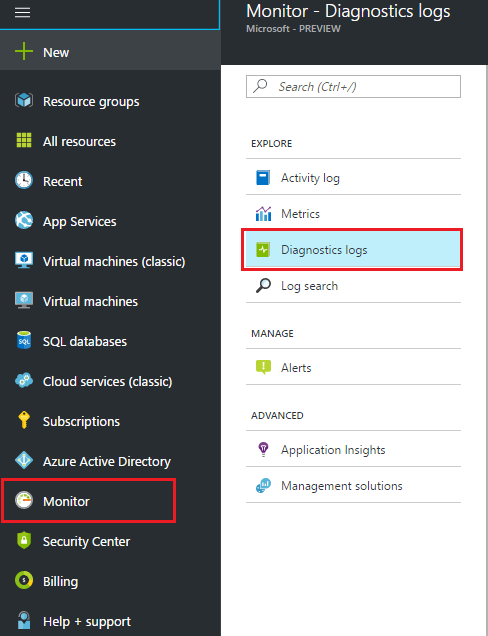
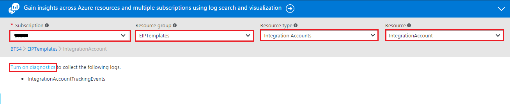
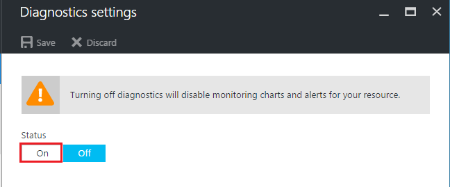
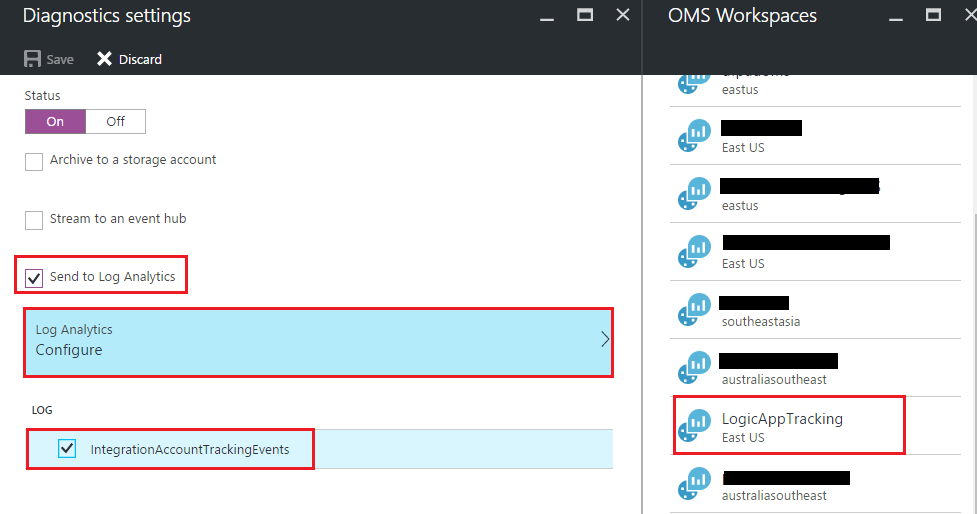

<properties 
	pageTitle="Monitor your Integration Account | Microsoft Azure" 
	description="How to monitor Inegration Account" 
	authors="padmavc" 
	manager="erikre" 
	editor="" 
	services="logic-apps" 
	documentationCenter=""/>

<tags
	ms.service="logic-apps"
	ms.workload="integration"
	ms.tgt_pltfrm="na"
	ms.devlang="na"
	ms.topic="article"
	ms.date="10/21/2016"
	ms.author="padmavc"/>

# Monitor your Integration Account

You can configure your Integration Account to use Azure Diagnostics for more rich details and debugging

1. Select **Monitor** and  click **Diagnostics logs**     

2. Select your **Subscription** and **Resource Group**, **Integration Account** from Resource Type and select your **Integration Account** from Resource drop down to enable diagnostics.  Click on **Turn on Diagnostics** to enable diagnostcis for the selected Integration Account               

3. Select status **ON**          
 
4. Select **Send to Log Analytics** and configure Log Analytics to emit data               



## Trakcing Schema

Currently supporting following track records types  
* AS2Message
* AS2MDN
* X12Interchange
* X12Group
* X12TransactionSet
* X12TechnicalAcknowledgement
* X12FunctionalAcknowledgement
* EDIFACTInterchange
* EDIFACTGroup
* EDIFACTTransactionSet
* EDIFACTTechnicalAcknowledgement
* EDIFACTFunctionalAcknowledgement
* Custom

All of them will have fixed schemas except Custom type.

## AS2 Message Schema
````java script

         "agreementProperties": {
             "senderPartnerName": "The name of the sending partner - type string",         
             "receiverPartnerName": "The name of the receiving partner - type string",         
             "as2From": "AS2-From - type string",         "as2To": "AS2-To - type string",         
             "agreementName": "The name of the agreement - type string"       },       
             "messageProperties": {          
                 "direction": "Send/Receive - type enum",          
                 "messageId": "The AS2 MessageId of the incoming or outgoing message- type string",          
                 "dispositionType": "Disposition type - type string",          
                 "fileName": "The value of file name from the content disposition header - type string",          
                 "isMessageFailed": "Whether the message processing succeeded or not - type boolean",          
                 "isMessageSigned": "whether the message signed or not. - type boolean",          
                 "isMessgeEncrypted": "Whether the message encrypted or not. - type boolean",          
                 "isMessageCompressed": "Whether the message compressed or not. - type boolean",          
                 "incomingHeaders": "All the inbound headers - Maybe we should strip out x-ms headers which may contain tokens.",          
                 "isNrrEnabled": "Determines whether Nrr is enabled or not. - type boolean",          
                 "isMdnExpected": "Whether the MDN is expected or not – type boolean"
         } 
````

## AS2 MDN Schema
````java script

        "agreementProperties": {         
            "senderPartnerName": "The name of the sending partner - type string",         
            "receiverPartnerName": "The name of the receiving partner - type string",         
            "as2From": "AS2-From - type string",         
            "as2To": "AS2-To - type string",         
            "agreementName": "The name of the agreement - type string"       
            },       
            "mdnProperties": {          
                "Direction": "Send/Receive - type enum",          
                "MessageId": "The AS2 MessageId of the incoming or outgoing MDN - type string",          
                "originalMessageId": "Original MessageId – The message Id for which the ack is being processed - type string",          
                "dispositionType": "Disposition type - type string",          
                "isMessageFailed": "Whether the message processing succeeded or not - type boolean",          
                "isMessageSigned": "whether the message signed or not. - type boolean"          
                "isNrrEnabled": "Determines whether Nrr is enabled or not - type boolean",          
                "mdnStatusCode": "Ack status code – Accepted/Rejected/AcceptedWithErrors - type enum",          
                "micVerification": "Mic verification status – NotApplicable/Succeeded/Failed - type enum",          
                "incomingHeaders": "All the incoming headers - Maybe we should strip out x-ms headers which may contain tokens.",          
                "outgoingHeaders": "All the outgoing headers in case of outgoing MDN"       
                } 

````

## X12 Interchange schema 
````java script

        "agreementProperties": {         
            "senderPartnerName": "The name of the sending partner - type string",         
            "receiverPartnerName": "The name of the receiving partner - type string",         
            "senderIdentifier": "Identifier of sending partner - type string",         
            "senderQualifier": "Qualifier of sending partner - type string",         
            "receiverIdentifier": "Identifier of receiving partner - type string",         
            "receiverQualifier": "Qualifier of receiving partner - type string",         
            "agreementName": "The name of the agreement - type string"               },       
            "interchangeProperties": {         "direction": "Send/Receive - type enum",                  
            "interchangeControlNumber": "Interchange control number - type string",         
            "componentSeparator": "Ascii value of the component separator to be used in the message - type int",         
            "dataElementSeparator": "Ascii value of the data element separator to be used in the message - type int",         
            "segmentTerminator": "Ascii value of the segment terminator to be used in the message - type int",         
            "segmentTerminatorSuffix": "Suffix for the segment terminator - type string", 
            "replacementCharacter": "Ascii value of the replace char to be used in the message - type int",            
            "functionalAckExpected": "Is functional ack expected for the message – type bool",    
            "technicalAckExpected": "Is technical ack expected for the message – type bool",     
            "exception": "Exception message if any – type string",         
            "isA05": "Interchange ID Qualifier - type string ",         
            "isA06": "Interchange Sender ID - type string ",         
            "isA07": "Interchange ID Qualifier - type string ",         
            "isA08": "Interchange Receiver ID - type string ",         
            "isA09": "Interchange Date - type string ",         
            "isA10": "Interchange Time - type string ",         
            "isA11": "Interchange Control Standards ID - type string ",         
            "isA12": "Interchange Control Version Number - type string ",         
            "isA13": "Interchange Control Number - type string ",         
            "isA14": "Acknowledgement Requested - type string ",         
            "isA15": "Test Indicator - type string ",         
            "isA16": "Sub element Separator - type string ",  
            }

````

## X12 Functional Group schema
````java script

        "agreementProperties": {         
            "senderPartnerName": "The name of the sending partner - type string",         
            "receiverPartnerName": "The name of the receiving partner - type string",         
            "senderIdentifier": "Identifier of sending partner - type string",         
            "senderQualifier": "Qualifier of sending partner - type string",         
            "receiverIdentifier": "Identifier of receiving partner - type string",         
            "receiverQualifier": "Qualifier of receiving partner - type string",         
            "agreementName": "The name of the agreement - type string"               
            },       
            "functionalGroupProperties": {          
                "direction": "Send/Receive - type enum",                   
                "interchangeControlNumber": "Interchange control number - type string",         
                "groupControlNumber": "Group control number - type string",         
                "gS01": "Functional ID code - type string ",          
                "gS02": "Application Sender's Code - type string ",          
                "gS03": "Application Receiver's Code - type string ",          
                "gS04": "Date - type string ",         "gS05": "Time - type string ",         
                "gS06": "Group Control Number - type string ",         
                "gS07": "Responsible Agency Code - type string ",         
                "gS08": "Version/Rel. Ind. ID Code - type string ",   
                } 


`````

## X12 Transaction set schema 
````java script

        "agreementProperties": {         
            "senderPartnerName": "The name of the sending partner - type string",         
            "receiverPartnerName": "The name of the receiving partner - type string",         
            "senderIdentifier": "Identifier of sending partner - type string", 
            "senderQualifier": "Qualifier of sending partner - type string",         
            "receiverIdentifier": "Identifier of receiving partner - type string",         
            "receiverQualifier": "Qualifier of receiving partner - type string",         
            "agreementName": "The name of the agreement - type string"               
            },       
            "transactionSetProperties": {          
                "direction": "Send/Receive - type enum",                  
                "interchangeControlNumber": "Interchange control number - type string",         
                "groupControlNumber": "Group control number - type string",         
                "transactionSetControlNumber": "Transaction set control number - type string",          
                "st01": "Transaction set ID code - type string ",          
                "st02": "Transaction set control number - type string ",          
                "se01": "Number of included segments - type string ",          
                "se02": "Transaction set control number - type string ",   
                } 


`````

## X12 Functional Acknowledgement schema
````java script 

        "agreementProperties": {         
            "senderPartnerName": "The name of the sending partner - type string",         
            "receiverPartnerName": "The name of the receiving partner - type string",         
            "senderIdentifier": "Identifier of sending partner - type string",         
            "senderQualifier": "Qualifier of sending partner - type string",         
            "receiverIdentifier": "Identifier of receiving partner - type string",         
            "receiverQualifier": "Qualifier of receiving partner - type string",         
            "agreementName": "The name of the agreement - type string"               },       
            "functionalAckProperties": {          "direction": "Send/Receive - type enum",                   
            "messageType": "Namespace of the type of message - type string",                 
            "incomingTransactionSetControlNumber": "Transaction set control number - type string",         
            "functionalAckExpected": "Is functional ack expected for the message – type bool",     
            "technicalAckExpected": "Is technical ack expected for the message – type bool",          
            "isFunctionalAck": "Is functional ack for the message – type bool",          
            "isSystemGeneratedAck": "Is ack generated by the connector for the message – type bool",          
            "header": {         
                "ak101": "Function group id of the group being ack’d – type string",          
                "ak102": "Group control number (GS06 and GE02) of the functional group being acknowledged – type string",          
                "ak103": "EDI implementation version sent in the GS08 of the original transaction (optional) – type string",         
                }          
            "ak201": "Transaction set ID (ST01) of the transaction set being acknowledged – type string",          
            "ak202": "Transaction set control number (ST02 and SE02) of the transaction set being acknowledged – type string",          
            "ak203": "EDI implementation version sent in the ST03 of the original transaction (optional) – type string",          
            "ak301": "Identifies the segment in error with its X12 segment ID – type string",          
            "ak302": "Is the segment count of the segment in error – type string",          
            "ak303": "Identifies a bounded loop: a loop surrounded by an LS segment and a LE segment – type string",
            "ak304": "Is the error code for the error in the data segment – type string",          
            "ak41.1": "Identifies the data element or composite data structure in error with its numerical count – type string",          
            "ak41.2": "Identifies the numerical count of the component data element in a composite data structure that has an error – type string",          
            "ak41.3": "Position of data element (optional) – type string",          
            "ak402": "Identifies the simple X12 data element number of the element in error (optional) – type string",          
            "ak403": "Reports the error of the identified element – type string",          
            "ak404": "Copy of the identified data element in error – type string",          
            "ak501": "Status of transaction set (A, E & R) – type string",          
            "ak502": "Error codes – type string",          
            "ak503": "Error codes – type string",          
            "ak504": "Error codes – type string",          
            "ak505": "Error codes – type string",          
            "ak506": "Error codes – type string",          
            "trailer": { 
                "ak901": "Status of the functional group being ack’d – type string",          
                "ak902": "number of transaction sets included in the identified functional group trailer (GE01) – type string",          
                "ak903": "number of transaction sets received – type string",          
                "ak904": "number of transaction sets accepted in the identified functional group – type string",          
                "ak905": "errors noted in the identified functional group – type string",          
                "ak906": "errors noted in the identified functional group – type string",          
                "ak907": "errors noted in the identified functional group – type string",          
                "ak908": "errors noted in the identified functional group – type string",          
                "ak909": "errors noted in the identified functional group – type string",         
                }} 

````

## X12 Technical Acknowledgement schema 
````java script

        "agreementProperties": 
        {         
            "senderPartnerName": "The name of the sending partner - type string",         
            "receiverPartnerName": "The name of the receiving partner - type string",         
            "senderIdentifier": "Identifier of sending partner - type string",         
            "senderQualifier": "Qualifier of sending partner - type string",         
            "receiverIdentifier": "Identifier of receiving partner - type string",         
            "receiverQualifier": "Qualifier of receiving partner - type string",         
            "agreementName": "The name of the agreement - type string"               
            },       
            "technicalAckProperties": 
            {          
                "direction": "Send/Receive - type enum",                   
                "messageType": "Namespace of the type of message - type string",          
                "incomingInterchangeControlNumber": "Interchange control number from the message body - type string",                  
                "isTechnicalAck": "Is technical ack for the message – type bool",           
                "isSystemGeneratedAck": "Is ack generated by the connector for the message – type bool",          
                "functionalAckExpected": "Is functional ack expected for the message – type bool",     
                "technicalAckExpected": "Is technical ack expected for the message – type bool",          
                "tA101": "Interchange control number – type string",          
                "tA102": "Interchange Date – type string",          
                "tA103": "Interchange Time – type string",          
                "tA104": "Status of interchange (A, E & R) – type string", 
                "tA105": "Interchange Note Code – type string",       
                } 

````

 


